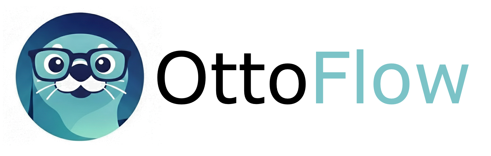

# OttoFlow



[](https://kubernetes.io/)
[](https://golang.org/)
[](LICENSE.md)

**Autonomous AI workflows for Kubernetes.** Define a workflow as a CRD, and OttoFlow
runs it as a DAG that mixes deterministic CEL, live cluster queries, and LLM agents —
with the LLM constrained to the one step that needs judgement.

## A workflow, and what it actually prints

```yaml
apiVersion: ottoflow.nirmata.io/v1alpha1
kind: Workflow
metadata:
  name: pod-triage
  namespace: ottoflow
spec:
  steps:
    # 1. Collect — CEL over live cluster state. No LLM.
    - name: collectPods
      resourceQuery:
        apiVersion: v1
        resource: Pod
        namespace: '"default"'
        outputs:
          totalPods: size(items)
          highRestartPods: items.filter(i, has(i.status.containerStatuses) &&
            i.status.containerStatuses.exists(c, int(c.restartCount) > 3)).map(i, i.metadata.name)

    # 2. Analyze — the agent sees only that summary, never raw pod specs.
    - name: triagePods
      dependsOn: [collectPods]
      agentRef:
        name: pod-triage-agent
        additionalPrompts:
          - >-
            format("Cluster snapshot -- total pods: %d, high-restart pods: %v.",
              variables.totalPods, variables.highRestartPods)

    # 3. Publish — gated on what Collect actually found.
    - name: publishTriage
      dependsOn: [triagePods, collectPods]
      matchConditions:
        - name: pods-were-found
          expression: variables.totalPods > 0
```

Run it against your cluster:

```sh
ottoflow run pod-triage --workflow-dir samples
```

```
collectPods                    ✅ Succeeded          22ms
triagePods                     ✅ Succeeded          27.88s
publishTriage                  ✅ Succeeded          262µs

Outputs:
  triageSummary:
  3 pods scanned, 1 flagged for high restarts. Verdict: Investigate the persistent
  crash-loop in pod `crashy` by examining its logs and resource usage immediately
  to determine if OOM or misconfiguration is the cause.
```

The full sample is [`samples/workflows/production/pod-triage.yaml`](samples/workflows/production/pod-triage.yaml).

## Why not just give an agent cluster access?

Most Kubernetes AI automation follows the same shape: **collect** cluster data,
**analyze** it, **publish** a result. Handing that whole loop to one agent with
cluster credentials makes every run non-deterministic, widens the attack surface,
and pays tokens to re-derive facts a query already knows.

OttoFlow keeps collection and publication deterministic — CEL, resource queries,
explicit dependencies — and spends the model only where judgement is actually
required. The agent in the example above never sees a pod spec, only the summary
the previous step computed. That is the whole design.

OttoFlow is not a general-purpose agent framework. If you want free-form agents,
use one of those instead.

## Quick start

**Prerequisites:** a Kubernetes cluster (1.29+) and `kubectl`. For building from
source: Go 1.26+. For the full development loop: `docker`, `kind`, `helm`, and `ko`.

```sh
make build-cli
```

### Run locally, no controller needed

Local mode loads workflows from a directory and executes them in-process against
your current kubecontext. It is the fastest way to see OttoFlow work:

```sh
./bin/ottoflow run cluster-overview --workflow-dir samples
```

`--namespace` must match the workflow's own `metadata.namespace`. Add `--input
key=value` to pass inputs.

### Run from a URL or stdin (zero clone)

`-f`/`--file` runs a single manifest locally, in-process, without cloning the repo or
using `--workflow-dir`. It accepts a file path, an http(s) URL, or `-` for stdin:

```sh
curl -sSL https://raw.githubusercontent.com/nirmata/ottoflow/main/samples/workflows/features/hello-world.yaml \
  | ./bin/ottoflow run -f -

./bin/ottoflow run -f https://raw.githubusercontent.com/nirmata/ottoflow/main/samples/workflows/production/pod-triage.yaml
```

The namespace follows the manifest's own `metadata.namespace` (defaulting to
`"default"` when unset) — `--namespace` has no effect here. Workflows built only from
`expressions` or agent steps need no cluster at all. A step that does need one
(`resourceQuery`, `mutate`, or a `resource.*` CEL function) fails with a clear
`kubernetes client not available` error instead of a stack trace when no kubeconfig is
present. Plain `http://` URLs are rejected unless you pass `--allow-insecure-url`.

### Run in-cluster

```sh
helm upgrade --install ottoflow oci://ghcr.io/nirmata/ottoflow \
  --version 0.1.0-rc1 --namespace ottoflow --create-namespace

kubectl apply -f samples/workflows/production/cluster-overview.yaml
./bin/ottoflow run cluster-overview --namespace ottoflow
```

### Agent steps

Agent steps need an LLM. Set `modelProvider` on the `Agent` CRD — there is no
default. Supported: `openai`, `anthropic`, `azure-openai`, `google`/`gemini`, and
`local` (any llama.cpp-compatible server: llama.cpp, ollama, vLLM, LM Studio).

API keys come from the **process environment** — `OPENAI_API_KEY`,
`ANTHROPIC_API_KEY`, `GEMINI_API_KEY`, `AZURE_OPENAI_API_KEY` — not from
`Agent.spec.config`. In-cluster, set them on the agent-executor pod via
`agentExecutor.env` in the Helm chart; in local mode they come from your shell.

`local` reads its server address from `LLAMACPP_HOST`, so the sample above runs
against ollama with no cloud key at all:

```sh
LLAMACPP_HOST=http://127.0.0.1:11434/ \
  ./bin/ottoflow run pod-triage --workflow-dir samples --model llama3
```

See [`agent-openai.yaml`](samples/workflows/features/agent-openai.yaml),
[`agent-azure-openai.yaml`](samples/workflows/features/agent-azure-openai.yaml),
[`agent-gemini.yaml`](samples/workflows/features/agent-gemini.yaml),
[`agent-local-llamacpp.yaml`](samples/workflows/features/agent-local-llamacpp.yaml) and
[`agent-custom-endpoint.yaml`](samples/workflows/features/agent-custom-endpoint.yaml) for
per-provider configuration.

## Step types

A step performs exactly one action.

| Step | Purpose |
|---|---|
| `expressions` | Pure CEL evaluation |
| `resourceQuery` | Kubernetes GET / LIST |
| `agentRef` | LLM step, with optional MCP tools |
| `mcpToolCall` | Direct MCP tool invocation |
| `prometheusQuery` | PromQL with template variables |
| `mutate` | Kyverno-style resource patching |
| `forEach` | Parallel iteration with a worker pool |
| `workflowRef` | Sub-workflow execution |
| `stepTemplateRef` | Instantiate a parameterised template |
| `externalAgentRef` | Call an external A2A agent |
| `openReport` | OpenReports.io integration |
| `waitForCallback` | Pause until an external signal |

Dependencies are explicit: a step that reads another step's output must name it in
`dependsOn`. Triggers can be cron or Kubernetes events; workflows retry, branch on
`matchConditions`, and enforce CEL cost limits.

## Validate before you run

```sh
ottoflow validate -f samples/workflows/production/pod-triage.yaml
```

Catches CEL compile errors, missing `dependsOn`, and unresolvable references
without touching the cluster. Note that it does not compile `outputs[].value`
expressions, so it is a strong check rather than a complete one.

## Documentation

- [Getting started](docs/user/tasks/getting-started.md) and [installation](docs/user/tasks/installation.md)
- [Concepts](docs/user/concepts/) — architecture and execution model
- [API reference](docs/user/reference/api/) — Workflow, WorkflowRun, Agent, MCPServer, StepTemplate
- [CEL reference](docs/user/reference/cel-reference.md) — available functions, and the pitfalls worth reading first
- [Sample workflows](samples/workflows/README.md) — production use cases, feature demos, and test fixtures
- [Developer guide](DEVELOPER.md) and [design notes](docs/dev/DESIGN.md)

## Contributing

Contributions are welcome — see [CONTRIBUTING.md](CONTRIBUTING.md) for setup, style
and the PR process, and [GOVERNANCE.md](GOVERNANCE.md) for how decisions get made.

## License

`SPDX-License-Identifier: BUSL-1.1`

[Business Source License 1.1](LICENSE.md) (SPDX: `BUSL-1.1`) with an Additional Use
Grant. **You may run OttoFlow in production, including for your company's own
business operations, at no cost.** What is not permitted is selling OttoFlow itself
— as a paid product, a hosted service, or embedded in a competing offering. Each
version converts to Apache 2.0 four years after publication.

See the [Licensing FAQ](LICENSING-FAQ.md), or contact
[licensing@nirmata.com](mailto:licensing@nirmata.com) about commercial licensing.

---

<div align="center">

Built by the Nirmata team ·
[Report a bug](https://github.com/nirmata/ottoflow/issues) ·
[Documentation](docs/)

</div>
