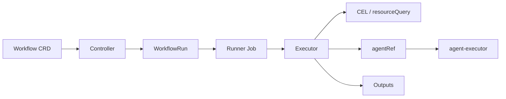

# OttoFlow

<!-- TODO: no dark-theme logo variant exists yet (images/ottoflow.png only). If one is
     added, switch to a <picture> with prefers-color-scheme for both GitHub themes. -->


**Kubernetes automation that spends an LLM only where judgement is needed —
the agent sees computed summaries, never raw cluster specs.**

[](https://github.com/nirmata/ottoflow/releases)
[](LICENSE.md)
[](https://golang.org/)
[](https://kubernetes.io/)

Source-available under BUSL-1.1 — free for production use, converts to
Apache-2.0 after 4 years. See [License](#license) below.

## 🚀 What is OttoFlow?

OttoFlow runs autonomous AI workflows on Kubernetes. You define a workflow as a
Kubernetes CRD, and OttoFlow executes it as a DAG (directed acyclic graph) that
mixes deterministic CEL, live cluster queries, and LLM agents — with the model
constrained to the one step that actually needs judgement. Collection and
publication stay deterministic; the LLM is spent only on analysis, and it sees
computed summaries rather than raw cluster objects.

## Why OttoFlow?

Kubernetes agentic applications generally follow a predictable pattern. They:

1. **Collect**: query cluster and workload data.
2. **Analyze**: process and synthesize that data, and
3. **Publish**: execute an action, or publish data or an event.

Offloading this entire loop to high-level prompts or unconstrained agents with
cluster access is an anti-pattern: it makes every run non-deterministic, widens
the attack surface, and drives up token cost.

OttoFlow codifies the `Collect → Analyze → Publish` loop into a deterministic
execution pattern, bringing reviewable engineering practices to the AI
orchestration layer. OttoFlow is not a general-purpose agent framework — if you
want free-form agents, use one of those instead.

## ✨ Key Features

- ✅ **Declarative, Kubernetes-native workflows** — define workflows as
  Kubernetes CRDs in YAML.
- ✅ **DAG execution** — explicit dependency resolution with parallel step
  batches.
- ✅ **Multi-provider LLM support** — reusable `Agent` CRDs for OpenAI,
  Anthropic, Azure OpenAI, Google/Gemini, or a local model.
- ✅ **Kubernetes integration** — query resources, scrape Prometheus (PromQL),
  react to events, and schedule via cron.
- ✅ **CEL expressions** — full Kubernetes and
  [Kyverno SDK CEL](https://github.com/kyverno/sdk) library support, with
  per-workflow cost limits.
- ✅ **Multiple step types** — Expressions, ResourceQuery, AgentRef,
  MCPToolCall, Mutate, ForEach, and more ([full list](#step-types)).
- ✅ **Summaries, not raw specs** — agent steps receive computed summaries,
  never raw cluster objects.
- ✅ **CLI with local mode** — execute workflows in-process against your
  kubecontext, no controller or CRDs required.
- ✅ **Retry & conditional execution** — configurable retry policies and
  `matchConditions` gating per step.
- ✅ **Extensive samples** — ready-to-run workflows under [`samples/`](samples/)
  covering cost, security, and compliance.

## Your first AI workflow in ~60 seconds

<!-- TODO (do not merge until stable v0.1.0 is released): the Homebrew formula is
     published only on a stable, non-prerelease tag; today only v0.1.0-rc1 exists. -->
```sh
brew install nirmata/tap/ottoflow
```

Start with a pure-CEL workflow — no LLM, no API key, nothing to install:

```sh
ottoflow run cluster-overview --workflow-dir samples -n ottoflow
```

This runs in-process against your current kubecontext, read-only — no
controller, no CRDs, nothing installed in your cluster, nothing to uninstall.

### Run it without cloning

<!-- TODO (do not merge until the `-f` URL/stdin PR lands): verify the exact flag
     behavior — whether `-f <url>` runs the file's workflow directly, and whether
     `-n ottoflow` is still needed — against that PR before merge. -->
```sh
ottoflow run -f https://raw.githubusercontent.com/nirmata/ottoflow/main/samples/workflows/production/pod-triage.yaml

# …or straight from a pipe, nothing saved to disk:
curl -sSL https://raw.githubusercontent.com/nirmata/ottoflow/main/samples/workflows/production/pod-triage.yaml \
  | ottoflow run -f -
```

### No API key? No problem.

`pod-triage` adds an LLM step, and the sample targets a **local** model by
default — no cloud key, and no cluster data leaves your machine:

```sh
LLAMACPP_HOST=http://127.0.0.1:11434/ \
  ottoflow run pod-triage --workflow-dir samples -n ottoflow --model gemma3:4b
```

Point `LLAMACPP_HOST` at any llama.cpp-compatible server — llama.cpp, ollama,
vLLM, LM Studio. It produces the transcript shown below. (Prefer a hosted model?
Set `--provider`/`--model` and the matching API-key environment variable instead.)

Agent steps need an LLM and there is no default provider: set `modelProvider` on
the `Agent` CRD to `openai`, `anthropic`, `azure-openai`, `google`/`gemini`, or
`local` (any llama.cpp-compatible server). API keys come from the **process
environment** — `OPENAI_API_KEY`, `ANTHROPIC_API_KEY`, `GEMINI_API_KEY`,
`AZURE_OPENAI_API_KEY` — not from `Agent.spec.config`. In-cluster, set them on the
agent-executor pod via `agentExecutor.env` in the Helm chart; in local mode they
come from your shell.

<!-- demo GIF: images/demo.gif — not committed yet; record it with `make demo`
     (needs vhs+ttyd+ffmpeg and a kind cluster, see images/demo.tape). Once the
     GIF is recorded and committed, embed it here with:
      -->

```
collectPods                    ✅ Succeeded          24ms
triagePods                     ✅ Succeeded          1.13s
publishTriage                  ✅ Succeeded          414µs

Outputs:
  triageSummary:
  4 pods scanned, 2 flagged unhealthy. Verdict: The crashy pod is the highest
  priority due to its significantly higher restart count (4), indicating a
  persistent issue requiring immediate attention.

  **Next Action:** Investigate the crashy pod's underlying cause by checking
  system logs for crash reasons and potential resource constraints.
```

_This verdict comes from a 4B local model, which latches onto the strongest
numeric signal (restart count). A larger local model — or a hosted provider
via `--provider` — weighs the failure modes (OOMKilled vs ImagePullBackOff)
more explicitly._

## A workflow, and what it actually prints

```yaml
apiVersion: ottoflow.nirmata.io/v1alpha1
kind: Workflow
metadata:
  name: pod-triage
  namespace: ottoflow
spec:
  steps:
    # 1. Collect — deterministic CEL over live cluster state. No LLM.
    - name: collectPods
      resourceQuery:
        apiVersion: v1
        resource: Pod
        namespace: '"default"'
        outputs:
          totalPods: size(items)
          # podFailureSignals: one has()-guarded CEL expression producing a list with
          # one line per unhealthy pod — restarts > 3, or a container waiting on
          # CrashLoopBackOff / ImagePullBackOff / ErrImagePull — e.g.
          #   "crashy: 12 restarts, last OOMKilled"
          #   "web-broken: 0 restarts, waiting ImagePullBackOff"
          # built from restartCount + lastState.terminated.reason / state.waiting.reason.
          podFailureSignals: "<CEL over items — full expression in the file linked below>"

    # 2. Analyze — the agent sees ONLY that computed list, never raw pod specs.
    #    Its job is to prioritize which pod to fix first, not narrate.
    - name: triagePods
      dependsOn: [collectPods]
      agentRef:
        name: pod-triage-agent
        additionalPrompts:
          - >-
            format("%d pods scanned, %d unhealthy. Per-pod failure signals: %v.",
              variables.totalPods, size(variables.podFailureSignals), variables.podFailureSignals)

    # 3. Publish — gated on what Collect actually found.
    - name: publishTriage
      dependsOn: [triagePods, collectPods]
      matchConditions:
        - name: pods-were-found
          expression: variables.totalPods > 0
```

This is an excerpt — the full file is
[`samples/workflows/production/pod-triage.yaml`](samples/workflows/production/pod-triage.yaml).
Run it yourself with `ottoflow run pod-triage --workflow-dir samples -n ottoflow` —
the transcript above is what it prints.

The agent above never sees a pod spec — only the summary the previous step
computed. That is the whole design.

## Going deeper: root cause from logs

`pod-triage` is the 30-second story — it runs anywhere, in-process, from Pod
status alone. When you need the *why* behind a failure,
[`workload-troubleshooter.yaml`](samples/workflows/production/workload-troubleshooter.yaml)
takes one failing pod, collects its events and last 200 log lines, and asks the
agent for a root cause and remediation. It needs the in-cluster controller — CLI
local mode can't fetch logs — so treat it as the depth story to the hero's speed
story.

## Five workflows you'll actually use

All paths are under [`samples/workflows/production/`](samples/workflows/production/).

| Workflow | What it does | You get |
|---|---|---|
| [`cluster-overview.yaml`](samples/workflows/production/cluster-overview.yaml) | Pure-CEL cluster snapshot — pod phases, per-namespace CPU/memory requests and limits, health verdict. No LLM, runs anywhere. | Structured report, zero prerequisites. |
| [`pod-triage.yaml`](samples/workflows/production/pod-triage.yaml) | Collect → Analyze → Publish; CEL extracts per-pod failure signals (restarts, OOMKilled, ImagePullBackOff), the LLM picks the single highest-priority pod and the concrete next action. | Prioritized verdict + next step. |
| [`resource-hygiene.yaml`](samples/workflows/production/resource-hygiene.yaml) | Detects 14 categories of unused or stale resources; LLM writes the cleanup report, Prometheus gauges track it. | Prioritized markdown report + metrics. |
| [`cost-analyzer.yaml`](samples/workflows/production/cost-analyzer.yaml) | Right-sizing from resource specs plus metrics-server/Prometheus P95 usage, per-workload savings. | Markdown report + estimated monthly $ savings. |
| [`workload-troubleshooter.yaml`](samples/workflows/production/workload-troubleshooter.yaml) | One failing pod: events + logs → LLM root-cause. **⚠ in-cluster only** (needs pod logs; not available in CLI local mode). | Root cause + remediation. |

There are 80+ more workflows in [`samples/`](samples/) covering cost, security, and
compliance automation.

## Step types

A step performs exactly one action.

| Step | Purpose |
|---|---|
| `expressions` | Pure CEL evaluation |
| `resourceQuery` | Kubernetes GET / LIST |
| `agentRef` | LLM step, with optional MCP tools |
| `mcpToolCall` | Direct MCP tool invocation |
| `prometheusQuery` | PromQL with template variables |
| `mutate` | Kyverno-style resource patching |
| `forEach` | Parallel iteration with a worker pool |
| `workflowRef` | Sub-workflow execution |
| `stepTemplateRef` | Instantiate a parameterised template |
| `externalAgentRef` | Call an external A2A agent |
| `openReport` | OpenReports.io integration |
| `waitForCallback` | Pause until an external signal |

Dependencies are explicit: a step that reads another step's output must name it in
`dependsOn`. Triggers can be cron or Kubernetes events; workflows retry, branch on
`matchConditions`, and enforce CEL cost limits.

## Validate before you run

```sh
ottoflow validate -f samples/workflows/production/pod-triage.yaml
```

Catches CEL compile errors, missing `dependsOn`, and unresolvable references
without touching the cluster. Note that it does not compile `outputs[].value`
expressions, so it is a strong check rather than a complete one.

## Install in your cluster

<!-- TODO (do not merge until stable v0.1.0 is released): only chart 0.1.0-rc1 exists today. -->
```sh
helm install ottoflow oci://ghcr.io/nirmata/ottoflow \
  --version 0.1.0-rc1 --namespace ottoflow --create-namespace

kubectl apply -R -f samples/
ottoflow run cluster-overview -n ottoflow
```

The controller reconciles Workflows/WorkflowRuns and runs the leader-elected
scheduler; agent steps execute via the agent-executor pod (set LLM keys via
`agentExecutor.env` in the chart).

## Supply-chain trust

Release archives publish a `checksums.txt`; verify a download before running it:

```sh
sha256sum --ignore-missing -c checksums.txt
```

Every change is scanned by [CodeQL](.github/workflows/codeql.yml) and kept current
by [Dependabot](.github/dependabot.yml), and security issues have a disclosure path
in [SECURITY.md](SECURITY.md).

<!-- TODO: cosign signatures, SBOMs, and SLSA provenance are not yet produced by the
     release pipeline. Add them to the supply-chain story here once the release
     workflow emits them — do not claim them until then. -->

## Architecture at a glance



## Documentation · Help · Contributing · License

- [Getting started](docs/user/tasks/getting-started.md) and [installation](docs/user/tasks/installation.md)
- [Concepts](docs/user/concepts/) — architecture and execution model
- [API reference](docs/user/reference/api/) — Workflow, WorkflowRun, Agent, MCPServer, StepTemplate
- [CEL reference](docs/user/reference/cel-reference.md) — available functions, and the pitfalls worth reading first
- [Sample workflows](samples/workflows/README.md) — production use cases, feature demos, and test fixtures
- [Developer guide](DEVELOPER.md) and [design notes](docs/dev/DESIGN.md)

Questions? Open a [GitHub Issue](https://github.com/nirmata/ottoflow/issues) —
Discussions are disabled.

Contributions are welcome — see [CONTRIBUTING.md](CONTRIBUTING.md) for setup, style
and the PR process, and [GOVERNANCE.md](GOVERNANCE.md) for how decisions get made.

## License

`SPDX-License-Identifier: BUSL-1.1`

[Business Source License 1.1](LICENSE.md) (SPDX: `BUSL-1.1`) with an Additional Use
Grant. **You may run OttoFlow in production, including for your company's own
business operations, at no cost.** What is not permitted is selling OttoFlow itself
— as a paid product, a hosted service, or embedded in a competing offering. Each
version converts to Apache 2.0 four years after publication.

See the [Licensing FAQ](LICENSING-FAQ.md), or contact
[licensing@nirmata.com](mailto:licensing@nirmata.com) about commercial licensing.

---

<div align="center">

Built by the Nirmata team ·
[Report a bug](https://github.com/nirmata/ottoflow/issues) ·
[Documentation](docs/)

</div>
